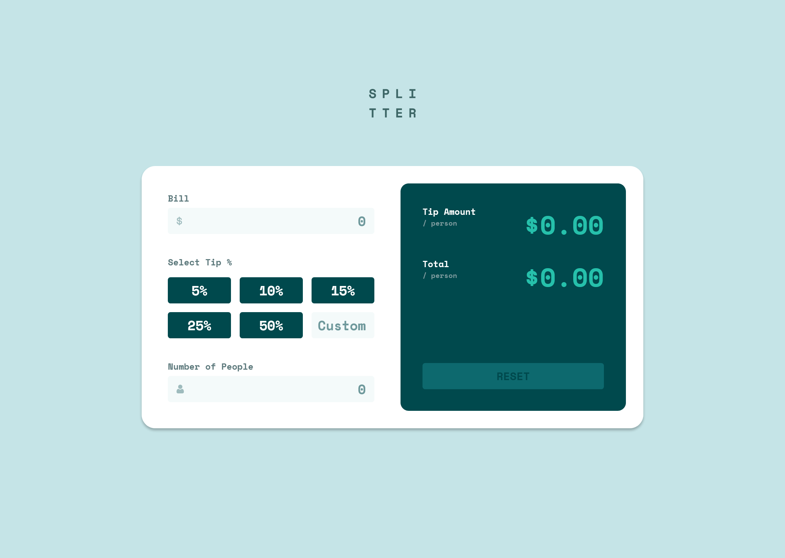

# Frontend Mentor - Tip calculator app solution

This is a solution to the [Tip calculator app challenge on Frontend Mentor](https://www.frontendmentor.io/challenges/tip-calculator-app-ugJNGbJUX). Frontend Mentor challenges help you improve your coding skills by building realistic projects.

## Table of contents

-   [Overview](#overview)
    -   [The challenge](#the-challenge)
    -   [Screenshot](#screenshot)
    -   [Links](#links)
-   [My process](#my-process)
    -   [Built with](#built-with)
    -   [What I learned](#what-i-learned)
    -   [Continued development](#continued-development)
    -   [Useful resources](#useful-resources)
-   [Author](#author)

## Overview

### The challenge

Users should be able to:

-   View the optimal layout for the app depending on their device's screen size
-   See hover states for all interactive elements on the page
-   Calculate the correct tip and total cost of the bill per person

### Screenshot

### Links

-   Solution URL: (https://github.com/Victoria-Sardelli/tip-calculator-app)
-   Live Site URL: (https://victoria-sardelli.github.io/tip-calculator-app/)

## My process

### Built with

-   Semantic HTML5 markup
-   CSS custom properties
-   Flexbox
-   CSS Grid
-   Mobile-first workflow

### What I learned

I learned a lot about how JavaScript can be used to interact with and manipulate the DOM, especially based on user input. I am glad I could practice object destructuring (which I had learned about recently), validation and error handling, and the use of regular expressions and data atrributes.
I also tried to follow the DRY principle, and organized my code into reusable functions accompanied by explanatory comments.

### Continued development

I would like to continue learning JavaScript concepts and best practices, particularly when it comes to organizing code, maintaining state, and validating user input.
I would also like to continue practicing general DOM manipulation using JS.

### Useful resources

-   [The Complete JavaScript Course 2023: From Zero to Expert!](https://www.udemy.com/course/the-complete-javascript-course/) - I've been going through this course recently in order to learn JavaScript, and I would really recommend it!! The teacher explains concepts thoroughly yet concisely, with plenty of examples and coding challenges to make the information stick. There's also different "paths" you can take throuugh the course based on your personal interests and time restrictions.

## Author

-   Frontend Mentor - [@Victoria-Sardelli](https://www.frontendmentor.io/profile/Victoria-Sardelli)
